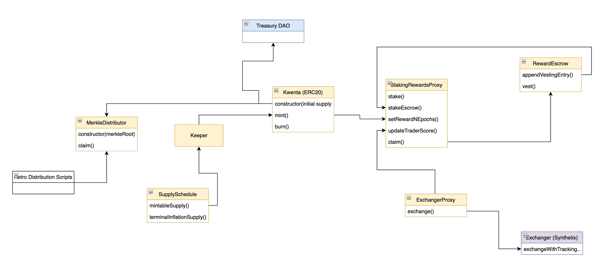

# Kwenta Token System

This is the main repository for the Kwenta token and respective system contracts (staking, escrow, distribution, etc..). 

The following architecture diagram represents a general overview of the system, but does not contain full detail of all implemented functions.



## Documentation

### Kwenta.sol

This contract is an extended ERC20 that's constructed with the name “Kwenta”, symbolized as “KWENTA”, and with an initial supply of 313373. The initial mint is seeded to the Kwenta treasuryDAO. 

Minting KWENTA can only be performed once a week. A percentage of the new supply will be diverted to the treasury (20%). The remainder will go into StakingRewards and towards the minter (keeper) fee. There is also burn functionality which is used by our vesting fee mechanism further described below.

### SupplySchedule.sol

Similar to Synthetix, this contract describes the inflationary supply schedule over the next four years. There is 1% terminal inflation. Inflation begins as soon as the contract is deployed. Decay begins on week 2, meaning the first week’s rewards are not affected by decay. The current inflation target is roughly 1,009,409.43 KWENTA tokens at the end of four years. The initial weekly emission is calculated from INITIAL SUPPLY * 240% APY. Decay occurs at a rate of 2.05% a week and this should bring the weekly emission near the 1% APY mark at the end of four years.

### StakingRewards.sol

A modified StakingRewards contract with support for escrowed KWENTA staking, trading rewards accumulated in epochs, and upgradeability.

Each week the StakingRewards contract is topped up with new inflationary supply and this action also kicks off the next trading rewards epoch. Rewards are split between stakers (80%) and traders (20%). Traders are required to be staked and stakers will consist of regular KWENTA stakers and escrowed KWENTA stakers. To determine a trader’s “rewardScore” we utilize a Cobb-Douglas* function with feesPaid (to the Synthetix Exchanger) and staked amount as inputs. See formula below for details. 

When rewards are harvested they are escrowed in RewardEscrow for a year.

This contract was made upgradeable (UUPS) to give flexibility when rewarding additional tokens, but also factoring in additional Kwenta offerings (futures) into the trading rewards system.

*This implementation of the Cobb-Douglas function required Fixidity’s logarithm library which required a conversion of unsigned to signed integers as inputs and a conversion of the `power_any` output back to unsigned.


*Details: [Full Staking Mathematical Breakdown](docs/Kwenta_Staking.pdf)*

### RewardEscrow.sol

Based on Synthetix’s BaseRewardEscrowV2 with migration and account merging functionality stripped out. Supports appending escrow entries from StakingRewards, but also outside parties through `createEscrowEntry`. Kwenta will be locked for a year if claimed via StakingRewards. 

Any escrowed Kwenta can also be staked back into StakingRewards, boosting potential rewards for stakers. When staked, tokens are not transferred, but an “escrowedBalance” is accounted for in StakingRewards. There is additional logic to make sure sufficient Kwenta is unstaked when vesting rewards. 

Another new feature introduced here is a linearly decaying vesting fee that allows beneficiaries to vest early – at a cost. Immediate vesting is subject to a fee that is 80% of the escrowed amount. It falls to 0% as the reward reaches the end of the escrow duration. The fee is burned. 

### ExchangerProxy.sol

A simple contract that forwards trades to the Synthetix Exchanger, but updates each person’s trader score (currently measured as fees paid).


## Testing

```
npm run test
```
```
npm run test:contracts
```
```
npm run test:integration
```
```
npm run test:fork
```

## Deployment

*Coming soon...*

---

> ok I need KWENTA TOKEN TO GO LIVE. like VERY SOON. I cant take this anymore. every day I am checking discord and still no token. every day, check discord, no token. I cant take this anymore, I have under invested, by a lot. it is what it is. but I need the token to GO LIVE ALREADY. can devs DO SOMETHING??
