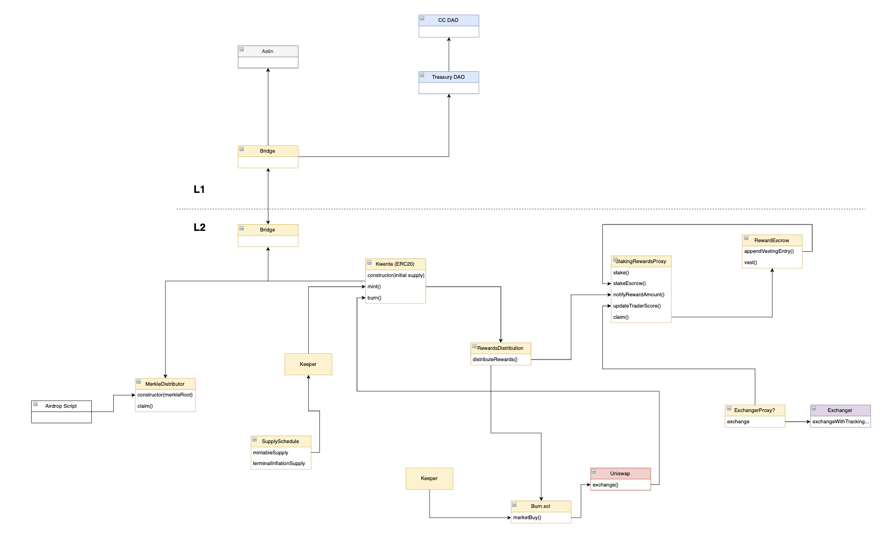

# Kwenta Tokenomics Repo

This is the main repository for the Kwenta token and respective system contracts (staking, distribution, bridge, buyback & burn, etc..).

The following architecture diagram is still in flux, but provides a general overview of the system.



## Testing

```
npx hardhat test
```

## Deployment

```
npx hardhat run ./scripts/deploy-kwenta.ts
```
