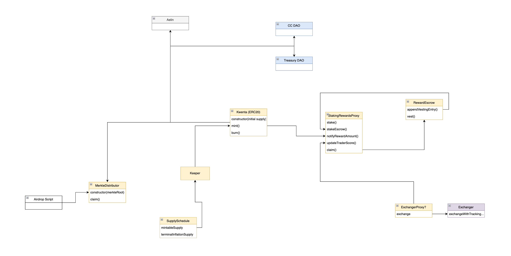

# Kwenta Token

> ok I need KWENTA TOKEN TO GO LIVE. like VERY SOON. I cant take this anymore. every day I am checking discord and still no token. every day, check discord, no token. I cant take this anymore, I have under invested, by a lot. it is what it is. but I need the token to GO LIVE ALREADY. can devs DO SOMETHING??

This is the main repository for the Kwenta token and respective system contracts (staking, escrow, distribution, bridge, etc..). 

The following architecture diagram is still in flux, but provides a general overview of the system.



## Testing

```
npm run test
```
```
npm run test:unit
```
```
npm run test:integration
```

## Deployment

```
npx hardhat run ./scripts/deploy-kwenta.ts
```
